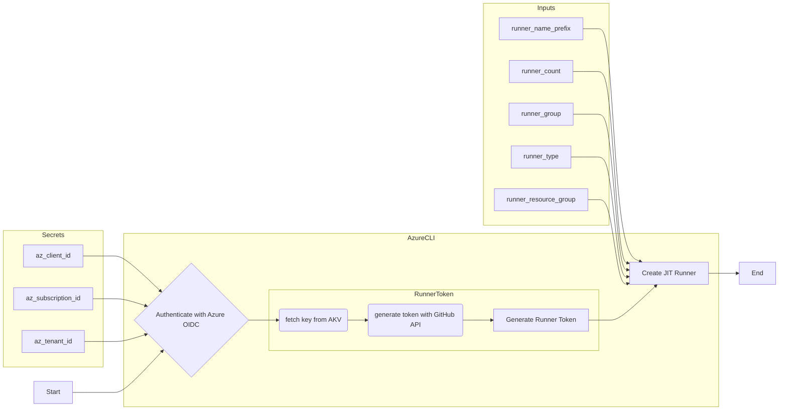
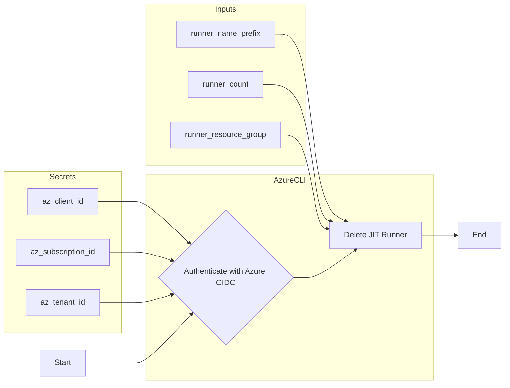

# azure-oidc-workflows

This repository contains reusable GitHub Actions workflows for managing Just-In-Time (JIT) runners in Azure. The workflows authenticate with Azure using OIDC, and provide the ability to create and delete JIT runners.

- [azure-oidc-workflows](#azure-oidc-workflows)
  - [reusable-create-jit-runner.yml](#reusable-create-jit-runneryml)
    - [Inputs, Secrets, and Outputs - reusable-create-jit-runner.yml](#inputs-secrets-and-outputs---reusable-create-jit-runneryml)
    - [Dependencies - reusable-create-jit-runner.yml](#dependencies---reusable-create-jit-runneryml)
    - [Usage - reusable-create-jit-runner.yml](#usage---reusable-create-jit-runneryml)
  - [reusable-delete-jit-runner.yml](#reusable-delete-jit-runneryml)
    - [Inputs, Secrets, and Outputs - reusable-delete-jit-runner.yml](#inputs-secrets-and-outputs---reusable-delete-jit-runneryml)
    - [Dependencies - reusable-delete-jit-runner.yml](#dependencies---reusable-delete-jit-runneryml)
    - [Usage - reusable-delete-jit-runner.yml](#usage---reusable-delete-jit-runneryml)
  - [Example Usage](#example-usage)

## reusable-create-jit-runner.yml

This workflow creates a JIT runner in Azure. It takes several inputs such as `runner_name_prefix`, `runner_group`, `runner_type`, `runner_resource_group`, and Azure credentials. The runner details are provided back to the calling workflow as outputs.

### Inputs, Secrets, and Outputs - reusable-create-jit-runner.yml

- Inputs:
  - `environment`: The GitHub environment to use for the deployment (e.g., production, staging).
  - `runner_name_prefix`: The prefix for the JIT runner name.  The runner name will be generated as `<runner_name_prefix>-<counter>`.
  - `runner_count`: The number of runners to create.
  - `runner_group`: The group to which the JIT runner belongs.
  - `runner_type`: The type of JIT runner (e.g., container, vm).
  - `runner_resource_group`: The resource group in which to create the JIT runner.
  - `runner_vnet`: The virtual network in which to create the JIT runner.
  - `runner_type`: The type of JIT runner (e.g., container, vm).  **`container`** is the only method supported type at this time.
- Secrets:
  - `az_client_id`: The Azure client ID for authentication.
  - `az_subscription_id`: The Azure subscription ID for authentication.
  - `az_tenant_id`: The Azure tenant ID for authentication.



### Dependencies - reusable-create-jit-runner.yml

- Azure CLI: The workflow uses the Azure CLI to authenticate with Azure and create the JIT runner.  The Azure CLI must be installed in the runner environment.
- Azure Subscription: The workflow requires an Azure subscription to authenticate with Azure. The subscription ID, client ID, and tenant ID must be provided as secrets to authenticate with OIDC.
- Azure Identity and Roles: The workflow requires that the Azure identity used to authenticate has the necessary permissions to create the JIT runner.
- Azure Resource Group: The workflow requires that an existing resource group be provided as input to create the JIT runner.
- JIT Runner Name Prefix and Count: The workflow requires the prefix name of the JIT runner to create as input, along with the count of runners to create.  The runner names will be generated as `<runner_name_prefix>-<counter>` and created in the provided `runner_resource_group`.

### Usage - reusable-create-jit-runner.yml

This workflow is designed to be used as reusable workflows in other repositories. To use a workflow, reference it in the uses field of a job in your workflow file, and provide the necessary inputs.

For example:

```yaml
jobs:
  create-jit-runner:
    uses: {owner}/{repository}/.github/workflows/reusable-create-jit-runner.yml@main
    with:
      runner_group: 'my-runner-group-name'
      runner_type: 'container'
      runner_resource_group: 'my-resource-group-name'
      runner_name: 'my-runner001'
      runner_count: 1
    secrets:
      az_client_id: ${{ secrets.AZURE_CLIENT_ID }}
      az_subscription_id: ${{ secrets.AZURE_SUBSCRIPTION_ID }}
      az_tenant_id: ${{ secrets.AZURE_TENANT_ID }}
```

## reusable-delete-jit-runner.yml

This workflow deletes a JIT runner in Azure. It takes the runner_name and runner_resource_group as inputs, along with Azure credentials.

### Inputs, Secrets, and Outputs - reusable-delete-jit-runner.yml

- Inputs:
  - `environment`: The GitHub environment to use for the deployment (e.g., production, staging).
  - `runner_name_prefix`: The prefix name of the JIT runner to delete. This will be used along with the `runner_count` to generate the runner names to delete.
  - `runner_count`: The number of runners to delete.
  - `runner_resource_group`: The resource group in which the JIT runner exists.
- Secrets:
  - `az_client_id`: The Azure client ID for authentication.
  - `az_subscription_id`: The Azure subscription ID for authentication.
  - `az_tenant_id`: The Azure tenant ID for authentication.



### Dependencies - reusable-delete-jit-runner.yml

- Azure CLI: The workflow uses the Azure CLI to authenticate with Azure and delete the JIT runner.  The Azure CLI must be installed in the runner environment.
- Azure Subscription: The workflow requires an Azure subscription to authenticate with Azure. The subscription ID, client ID, and tenant ID must be provided as secrets to authenticate with OIDC.
- Azure Identity and Roles: The workflow requires that the Azure identity used to authenticate has the necessary permissions to delete the JIT runner.
- Azure Resource Group: The workflow requires that an existing resource group be provided as input to delete the JIT runner.
- JIT Runner Prefix Name and Count: The workflow requires the prefix name of the JIT runner to delete as input, along with the count of runners to delete.  The runner names will be generated as `<runner_name_prefix>-<counter>` and deleted from the provided `runner_resource_group`.

### Usage - reusable-delete-jit-runner.yml

This workflow is designed to be used as reusable workflows in other repositories. To use a workflow, reference it in the uses field of a job in your workflow file, and provide the necessary inputs.

For example:

```yaml
jobs:
  delete-jit-runner:
    uses: {owner}/{repository}/.github/workflows/reusable-delete-jit-runner.yml@main
    with:
      runner_name: 'my-runner001'
      runner_resource_group: 'my-resource-group-name'
    secrets:
      az_client_id: ${{ secrets.AZURE_CLIENT_ID }}
      az_subscription_id: ${{ secrets.AZURE_SUBSCRIPTION_ID }}
      az_tenant_id: ${{ secrets.AZURE_TENANT_ID }}
```

## Example Usage

The following example demonstrates how to use the reusable workflows in a repository to create a JIT runner, execute a job on the runner, and then delete the runner.

```yaml
name: Deploy with JIT Runner

on:
  push:
    branches:
      - main

jobs:
  create-jit-runner:
    uses: {owner}/{repository}/.github/workflows/reusable-create-jit-runner.yml@main
    id: create-jit-runner
    with:
      runner_group: 'my-runner-group-name'
      runner_name_prefix: 'my-runner001'
      runner_count: 1
      runner_type: 'container'
      runner_image: 'ghcr.io/collinmcneese/runner-no-dind:latest'
      runner_resource_group: 'my-resource-group-name'
      runner_vnet: 'my-vnet-name'
      runner_location: 'eastus'
      runner_labels: 'label1,label2'
      environment: 'my-environment'
    secrets:
      # Secrets defined in the calling repository
      az_client_id: ${{ secrets.AZURE_CLIENT_ID }}
      az_subscription_id: ${{ secrets.AZURE_SUBSCRIPTION_ID }}
      az_tenant_id: ${{ secrets.AZURE_TENANT_ID }}

  deploy:
    name: Run Deployment
    runs-on:
      group: 'my-runner-group-name'
    environment: 'my-environment'
    steps:
      - name: Checkout code
        uses: actions/checkout@v4

      - name: Run deployment script
        run: ./deploy/deploy.sh

  delete-jit-runner:
    uses: {owner}/{repository}/.github/workflows/reusable-delete-jit-runner.yml@main
    # Set dependencies to ensure the runner is deleted after the job completes
    needs:
      - deploy
    # Always run the delete job, even if the deploy job fails
    if: always()
    with:
      runner_name_prefix: 'my-runner001'
      runner_count: 1
      runner_resource_group: 'my-resource-group-name'
      environment: 'my-environment'
    secrets:
      az_client_id: ${{ secrets.AZURE_CLIENT_ID }}
      az_subscription_id: ${{ secrets.AZURE_SUBSCRIPTION_ID }}
      az_tenant_id: ${{ secrets.AZURE_TENANT_ID }}
```
